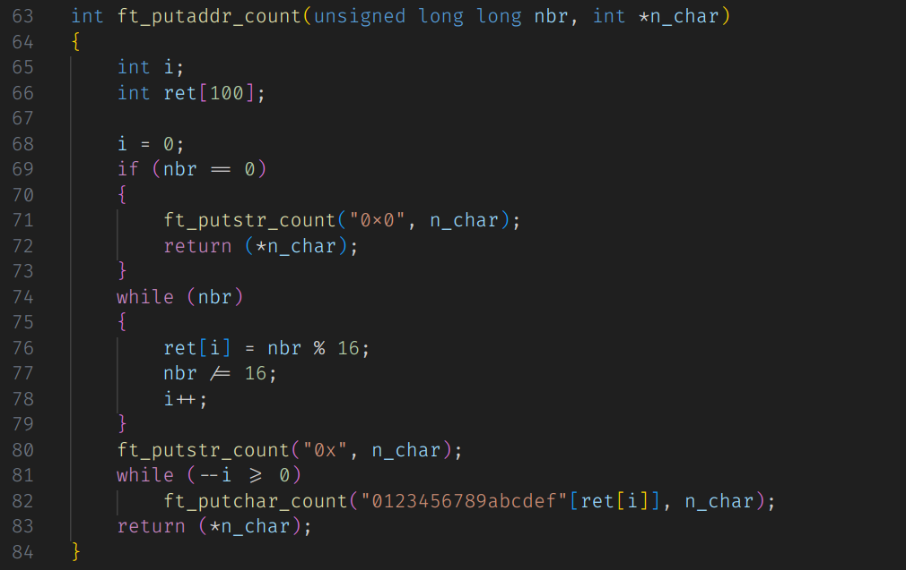

# ft_printf

The ft_printf project is a programming exercise in the C language that involves re-implementing the `printf()` function. It offers a customized version of `printf()`, providing students with a deeper understanding of variadic  arguments in C and variadic functions.

The goal is to implement a function named `ft_printf()` that mimics the behavior of the original `printf()`.

The mandatory part requests that the following conversions be supported: `c`, `s`, `p`, `d`, `i`, `u`, `x`, `X`, `%`.

### Getting Started

To use the ft_printf project:

- Clone the repository to your local machine.
- Compile the code using the provided Makefile.
- Test the custom `printf()` function with various inputs to ensure its accuracy.

### To Do: Implementing Bonus Features

I'm considering adding additional features to the ft_printf function included support for optional conversions, such as flags `-0.` and `# +`.